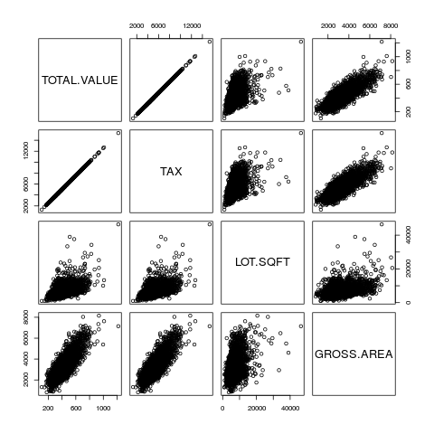
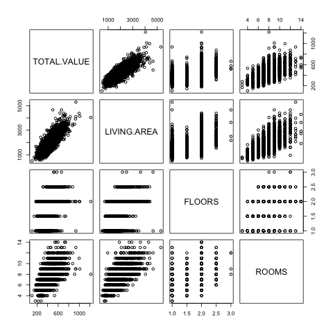
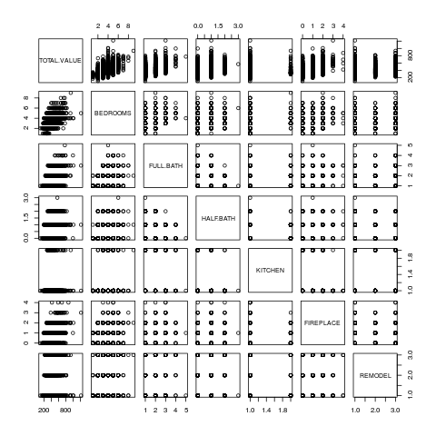

```{r}
packages_to_be_loaded=c("corrplot","dummies","forecast","gains","reshape","leaps")
for(i in packages_to_be_loaded){
    if(i%in%installed.packages()[,1]==F){install.packages(i)}
    require(i,character.only=T)
}
```

# Getting Started  

You will need to install the following packages for this week: *corrplot*, *reshape*, *dummies*, *leaps*, *forecast*, and *gains*.

## Step 1: Develop an understanding of the data mining project  


Instead of using assessed values provided by the city, can we create a model to better predict values of single family owner-occupied homes in West Roxbury, a neighborhood in southwest Boston, MA in 2014 (Shmueli et al 2018, Chapter 6)?  

## Step 2: Obtain the dataset to be used in the analysis  

City of Boston provided total assessed value and 13 other variables for 5,000+ single family owner-occupied homes in West Roxbury.  

## Step 3: Explore, clean, and preprocess the data

```{r}
#change the file path as needed
housing.df <- read.csv("WestRoxbury.csv", header=TRUE) 
```

```{r}
dim(housing.df)  # find the dimension of data frame
```

```{r}
head(housing.df)  # show the first six rows
```

```{r}
names(housing.df) # get names from housing data frame
```

```{r}
# Practice showing different subsets of the data
housing.df[1:10, 1]  # show the first 10 rows of the first column only
housing.df[1:10, ]  # show the first 10 rows of each of the columns 
#housing.df$TOTAL.VALUE  # a different way to show the whole first column
housing.df$TOTAL.VALUE[1:10]  # show the first 10 rows of the first column
housing.df[5, 1:10]  # show the fifth row of the first 10 columns
housing.df[5, c(1:2, 4, 8:10)]  # show the fifth row of some columns
```

```{r}
str(housing.df) #structure of data frame
```

```{r}
summary(housing.df) #five number summary for numeric variables; count summary for factors
```

```{r}
class(housing.df$REMODEL)
```

```{r}
levels(housing.df$REMODEL)
```

```{r}
summary(housing.df$BEDROOMS) #one missing value in row #2
# housing.df$BEDROOMS[is.na(housing.df$BEDROOMS)]=median(housing.df$BEDROOMS,na.rm=TRUE)
```

```{r}
summary(housing.df$TOTAL.VALUE) #one missing value in row #3
# housing.df$TOTAL.VALUE[is.na(housing.df$TOTAL.VALUE)]=mean(housing.df$TOTAL.VALUE,na.rm = TRUE)
```

What patterns do you see in the scatter plots below? 

```{r}
png(filename = "scatterplots1.png")
plot(housing.df[,c(1,2,3,5)])
dev.off()

png(filename = "scatterplots2.png")
plot(housing.df[,c(1,6,7,8)])
dev.off()

png(filename = "scatterplots3.png")
plot(housing.df[,c(1,9,10,11,12,13,14)])
dev.off()
# plot(housing.df[,c(1,2,3,5)])
# plot(housing.df[,c(1,6,7,8)])
# plot(housing.df[,c(1,9,10,11,12,13,14)])
```







### Correlation plot

```{r}
# using functions from library corrplot
corrs <- cor(housing.df[,c(1:3,5:13)]) #did not include YR.BUILT and REMODEL
corrs.matrix <- as.matrix(corrs)
corrplot(corrs.matrix)
corrplot(corrs.matrix, method="number")
```

Notice that the correlation plots show "?" for the variables with NA's. We have to exclude the NAs if we want to calculate the correlation coefficients for all variables and not deal with the "?" output. 

```{r}
housing.df.no.mv <- housing.df[c(-2,-3), ]#remove rows 2 & 3
corrs2 <- cor(housing.df.no.mv[,c(1:3,5:13)]) #did not include YR.BUILT and REMODEL
corrs2.matrix <- as.matrix(corrs2)
corrplot(corrs2.matrix)
corrplot(corrs2.matrix, method="number")
```

### Missing Values  

Two approaches: 1) delete the missing values but will lose these observations or 2) impute missing values with mean or median value. If the variable is normally distributed, use mean. If the distribution is skewed, use the median.  

```{r}
#housing.df <- housing.df[-2,] #remove row
housing.df$BEDROOMS[is.na(housing.df$BEDROOMS)]=median(housing.df$BEDROOMS,na.rm=TRUE)
housing.df$TOTAL.VALUE[is.na(housing.df$TOTAL.VALUE)]=mean(housing.df$TOTAL.VALUE,na.rm = TRUE)
```

```{r}
hist(housing.df$BEDROOMS)
```

```{r}
boxplot(housing.df$BEDROOMS)
```

```{r}
hist(housing.df$TOTAL.VALUE)
```

```{r}
boxplot(housing.df$TOTAL.VALUE)
```

```{r}
#Using the aggregate function
aggregate(housing.df$BEDROOMS, by=list(housing.df$FULL.BATH), FUN=mean, na.rm=TRUE)
```

```{r}
#Using melt and cast to create a Pivot Table
# using functions from library reshape
summary(housing.df$ROOMS)
housing.df$ROOMS.bin <- .bincode(housing.df$ROOMS, c(2:14)) #create bins 
mlt <- melt(housing.df, id = c("ROOMS.bin", "REMODEL"), measure=c("TOTAL.VALUE","FLOORS"))
cast(mlt, ROOMS.bin~REMODEL, subset= variable=="TOTAL.VALUE",
     median, na.rm=TRUE)
```

## Step 4: Reduce the data dimension  

We have 14 variables in total with only one categorical variable: REMODEL. The REMODEL variable has three categories: NONE, OLD, and RECENT. This is not too bad! If we were dealing with a large number of variables (think +40 variables) or a data set with many categorical variables (and many categories), we will need to determine whether some variables can be grouped together or remove to reduce the dimension of the data set. We will return to this topic in Week #5.  

## Step 5: Determine the data mining task  

We want to predict TOTAL.VALUE using the given predictor variables. Since we have a target variable, this is a supervised learning task. We will not use the TAX variable. TAX is determined by using the home value, which is what we are trying to predict. We will also remove ROOMS.bin, which is a variable we created earlier to make a Pivot Table.  

```{r}
housing.df.model <- housing.df[,c(-2,-15)]
```

## Step 6: Partition the data (for supervised tasks)  

We are using an 80-20 split, which is 80% of the data will be used to train our prediction model. The other 20% of the data will be used to "score" our prediction model. Note that we do not have a test set since we are not comparing multiple supervised models at the moment. 

```{r}

set.seed(123) #ensure we always get the same output 
housing.index <- housing.df.model[order(runif(5802)), ]#randomized the observations
train <- housing.index[1:4641, ] #create training set
valid <- housing.index[4642:5802, ] #create validation set

dim(train)
dim(valid)
```

## Step 7: Choose the data mining techniques to be used  

We will be using multiple linear regression to build a prediction model.  

## Step 8: Use algorithms to perform the task  

```{r}

options(scipen = 999) #ensure no scientific notation is displayed
housing.lm <- lm(TOTAL.VALUE~., data=train)
summary(housing.lm)
```

### Questions to answer:  

1. What is the goodness-of-fit?   
2. Which predictors are important?  
3. Is there a simpler prediction model (i.e. less predictors) that perform "just as well"?  

### Why should we reduce the number of predictors when computing cost is cheap? 

1. It may be expensive or unfeasible to collect all predictors for future prediction exercises.  
2. We may be able to measure fewer predictors more accurately.  
3. More predictors = more chances of missing values = more imputations or record deletions.  
4. Occam's Razor  
5. Estimates of regression coefficients are unstable due to multicollinearity. Multicollinearity is the presence of two or more predictors sharing the same linear relationship with the outcome variable.  
6. Bias-variance tradeoff: Predictors uncorrelated with the target variable increases the *variance* of predictions. At the same time, dropping variables that are correlated with the target variable can increase the average error (*bias*) of predictions.  

### Exhaustive Search for Reducing Predictors  

Before we can proceed, we have to create dummy variables for the REMODEL variable. (Remember that R's lm function does it automatically for us earlier.) In addition, we also have to remove one of the three newly created dummy variables: REMODELNone, REMODELOld, and REMODELRecent in order to run the exhaustive search algorithm. The reason is because linear regression models compare desired classes against a *reference* or *base* class. If we want to know the effect of recent remodelling on the total value of a home, we have to compare it against a reference/base class. The base class could be old remodeled home or never remodeled home. It does not matter which class, but we have to pick one. For this exercise, we will compare the *old* and *recent* remodeled homes against the base class of *never remodeled*. 

```{r}
# using functions from library dummies
train.dummies<-dummy("REMODEL", train)
valid.dummies<-dummy("REMODEL", valid)

train <- cbind(train, train.dummies) #prepped data + dummies
valid <- cbind(valid, valid.dummies) #prepped data + dummies

train.search <-train[,c(-13,-14)] #remove REMODEL & REMODELNone
valid.search <-valid[,c(-13,-14)] #remove REMODEL & REMODELNone

names(train.search) #checking column names
names(valid.search) #checking column names
```

The exhaustive search algorithm runs linear regression models on all possible subsets of predictors. We have to pick among all the subset models to find a desired model. Adjusted R-square is a popular method used to find the desired model.

The drawback of exhaustive search is that it is time consuming to search through all the possible subsets.  

```{r exhaustivesearch}
# Functions from library leaps
search <- regsubsets(TOTAL.VALUE~.,data=train.search, nbest=1, nvmax=dim(train.search)[2], method="exhaustive")
sum <- summary(search)
sum$which
sum$adjr2

```

Model #8 seems to be the model where the adjusted Rsquare does not improve much further. Here are the important predictors in Model #8: LOT.SQFT,GROSS.AREA, LIVING.AREA, FLOORS, FULL.BATH, HALF.BATH, FIREPLACE, and REMODELRecent. It is important to note that we are only including one dummy variable: REMODELRecent. Since there is no REMODELOld in this model, we are--in effect--comparing recently remodeled homes to a reference group of *never* and *old* remodeled homes. There is a difference in interpretation between Model #8 with the subsequent models shown for backward elimination, forward selection, and stepwise regression models below.  

```{r exhsearchmodel}
housing.lm.exhaust <- lm(TOTAL.VALUE~LOT.SQFT + GROSS.AREA + LIVING.AREA + FLOORS + FULL.BATH + HALF.BATH + FIREPLACE + REMODELRecent, data=train)
summary(housing.lm.exhaust)

```


### Backward Elimination Algorithm  

The algorithm starts with a set of given predictors and then eliminate the least useful predictors at each step. "Least useful" is defined as variables not statistically significant.  

Backward elimination is time consuming and unstable when you start with a large number of predictors.  


Is there any difference than our earlier regression model? 

```{r}
bwdreg <- step(housing.lm, direction="backward")
summary(bwdreg)
```

### Forward Selection Algorithm  

The algorithm starts with no predictors and then add predictors one at a time. The predictor added at each step has the largest contribution to R-square on top of the predictors that are already in it. The algorithm stops when the contribution of additional predictors are not statistically significant. 

The weakeness of this algorithm is that it will miss pairs of predictors that perform well together but poorly as single predictors. 

```{r}

fwdreg <- step(housing.lm, direction="forward")
summary(fwdreg)
```

### Stepwise Selection Algorithm   

The algorithm is a combination of forward selection and backward elimination algorithms. At each step, the algorithm adds additional predictors while removing ones that are not statistically significant.  

Stepwise algorithm has the same weakenesses as forward selection and backward elimination algorithms. 

```{r}

stepreg <- step(housing.lm, direction="both")
summary(stepreg)
```

## Step 9: Interpret the results  

The backward, forward, and stepwise selection algorithms did not include BEDROOMS (not significant).  exhaustive search model #8 also excludes ROOMS as a predictor. Here is a list of predictors that all selection algorithms show to be important: LOT.SQFT, GROSS.AREA, LIVING.AREA, FLOORS, FULL.BATH, HALF.BATH, KITCHEN, FIREPLACE, REMODELOld, and REMODELRecent. Here is a summary of what we found.

| Algorithm            | Excluded Predictor(s)                         | R-square |
|----------------------|-----------------------------------------------|----------|
| Exhaustive Search    | ROOMS;YR_BUILT | 81.2%    |
| Backward Elimination | BEDROOMS                                      | 81.4%    |
| Forward Selection    | BEDROOMS                                      | 81.4%    |
| Stepwise             | BEDROOMS                                      | 81.4%    |


It is up to you to determine which model should be chosen to deploy. Is it worthwhile to include four additional predictors to improve the linear regression model's goodness-of-fit by 0.2%? 

# Step 10: Deploy the model  

What do the error metrics look like for the stepwise regression model? 

```{r}

pred_v <- predict(stepreg, valid)
# using functions from forecast
accuracy(pred_v, valid$TOTAL.VALUE)
```

What about the exhaustive regression model? 

```{r}

pred_v <- predict(housing.lm.exhaust, valid)
# using functions from forecast
accuracy(pred_v, valid$TOTAL.VALUE)
```

#### Wait...Aren't You Cheating?  

Is it "cheating" if I use the RMSE (or any other error metric) to *go back* and choose an alternative model in Step #9? Yes! It's cheating. If you do choose to use the error metrics from the validation set to revise your model selection, you will need to use a third partition (i.e. the test set) to get true estimates of the error metrics.   


**Important:** As we discuss the logic of cross validation and the train/test/validate partitioning scheme, you should consider using `mlr` or a similar package that will select subsets based on out of sample performance. 


### Lift Chart  

The *naive* estimate of a home's value is the mean. The mean value for a home in the validation set is $392. We can show the model's mean estimate for each decile (10%) group against the naive estimate. The decile groups are ranked from highest estimated values to lowest estimated values.   

```{r}
#using functions from gains
gain.num <-gains(valid$TOTAL.VALUE, pred_v, groups=10)
```

```{r}
plot(gain.num$depth,gain.num$mean.resp, xlab = "decile", ylab="Mean Response", main = "Decile vs. Mean Response", type = "l")
abline(h=mean(valid$TOTAL.VALUE), col="red") #draw a horizontal line showing the naive estimate
```

```{r}
barplot(gain.num$mean.resp/mean(valid$TOTAL.VALUE), names.arg=gain.num$depth, xlab="Decile", ylab="Mean Response",
main="Decile-Wise Lift Chart")
abline(h=1,col='red')
```

```{r}
#print the lift values for decile groups
gain.num$mean.resp/mean(valid$TOTAL.VALUE)
```

                                              
How much better does our model do compare to the naive estimate? For the highest 10% of the estimates, our model's estimates would *potentially* allow us to gain 1.5 times the amount of revenue, compared to choosing 10% of the homes at random. 

## References  

Shmueli, Galit and et al (2018). Data Mining for Business Analytics: Concepts, Techniques, and Applications in R. Hoboken: Wiley. Chapter 6. 

